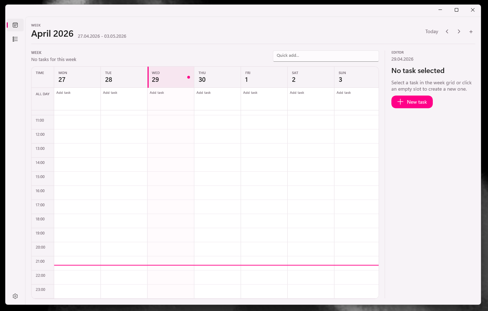
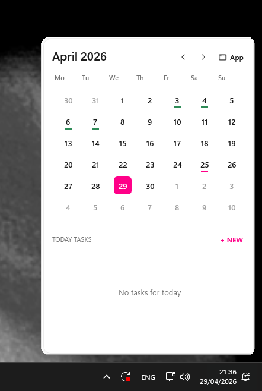

# WinCalendar

WinCalendar is a Windows calendar and planner app built with .NET 8 and WinUI. It combines a full weekly planning workspace with a compact tray calendar and a small taskbar overlay for quick access.



## Features

- Weekly planner with hourly slots, all-day tasks, quick add, and an editor panel.
- Compact calendar panel opened from the taskbar overlay or tray icon.
- Task categories, recurrence, duration, all-day tasks, and completion state.
- Light, dark, and system theme support.
- Configurable taskbar overlay with size and position controls.
- SQLite-backed local task storage.



## Project Structure

- `WinCalendar/WinCalendar.slnx` - main solution.
- `WinCalendar/WinCalendar/WinCalendar.csproj` - WinUI application project.
- `WinCalendar/WinCalendar.Tests/WinCalendar.Tests.csproj` - lightweight console test project.
- `WinCalendar/WinCalendar/Modules/Planner` - planner state, compact panel, settings, dialogs, and today view.
- `WinCalendar/WinCalendar/Modules/Shell` - tray icon, taskbar overlay, and shell integration.
- `WinCalendar/WinCalendar/Modules/Tasks` - task entities, repository contracts, SQLite infrastructure, and use cases.

## Build

Run from the repository root:

```powershell
dotnet build .\WinCalendar\WinCalendar.slnx
```

## Tests

```powershell
dotnet run --project .\WinCalendar\WinCalendar.Tests\WinCalendar.Tests.csproj
```

## Launch Modes

Normal launch opens the full app. Passing `--background` starts only the shell experience, including tray integration and the overlay:

```powershell
.\WinCalendar.exe --background
```
